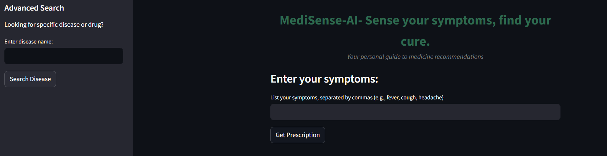
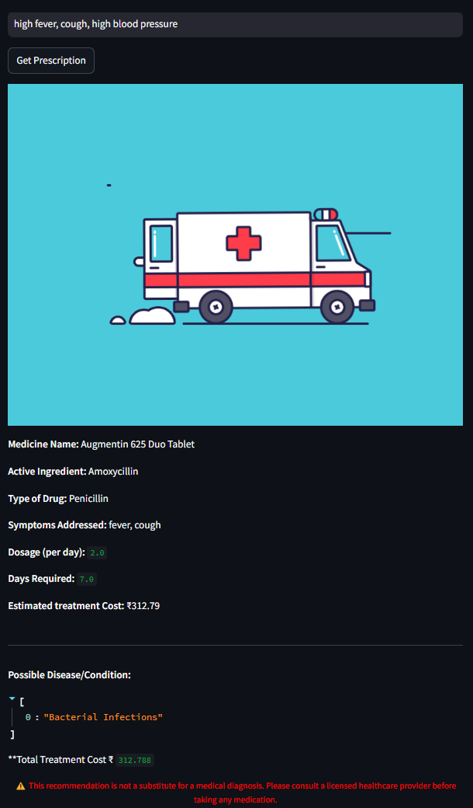

# MediSense-AI


**MediSense-AI** is a personal medicine assistant designed to help users make informed decisions about their health by providing personalized medicine recommendations based on their symptoms. This project utilizes a weighted semantic search approach over a vector dataset in PineCone. It comes with a user-friendly interface, making healthcare more accessible and efficient.

## Table of Contents

- [Features](#features)
- [Tech Stack](#tech-stack)
- [Installation](#installation)
- [Usage](#usage)
- [Datasets](#datasets)
- [Future Improvements](#future-improvements)

## Features




- **User-Friendly Interface:** Easy symptom input for quick medicine recommendations.
- **Intelligent Recommendations:** Uses AI to provide accurate medicine suggestions based on user input.
- **Detailed Information:** Offers insights into possible diseases, active ingredients, dosages, and estimated treatment costs.

## Tech Stack

- **Streamlit:** For building the interactive web application.
- **Pinecone:** To manage and query the medicine recommendation index.
- **SentenceTransformers:** Utilizing the BERT embeddings via "multi-qa-distilbert-cos-v1" model.
- **dotenv:** For secure management of API keys and environment variables.
- **NumPy:** For numerical computations and data handling.

## Installation

To run the MediSense-AI application locally, follow these steps:

1. Clone the repository:
   ```bash
   git clone https://github.com/HrithikRai/MediSense-AI.git
   cd medi-sense-ai
   
2. Activate Venv:
   ```bash
   python -m venv venv
   venv\Scripts\activate
   pip install -r requirements.txt

3. Create a .env file and insert:
   PINECONE_API_KEY = 'get your PineCone API key and insert it here'
   PINECONE_ENV = 'gcp-starter'

4. Run the Application - streamlit run app.py

## Usage
1. Open your browser and go to http://localhost:8501.
2. Enter your symptoms in the input box, separated by commas (e.g., "fever, cough, headache").
3. Click the "Get Prescription" button to receive medicine recommendations.
4. Review the suggestions, including possible diseases, active ingredients, dosages, and estimated treatment costs.



   
## Datasets
1. Indian-Medicine-Dataset - https://github.com/junioralive/Indian-Medicine-Dataset
2. treatment_dataset - It's a custom dataset that I made based on most common 100 drugs available in the Indian market and the corresponding symptoms and costs.(find in data folder)
   
## Future Improvements
1. Expanded Datasets: Integrate more comprehensive datasets for a wider array of medicines and conditions.
2. User Feedback System: Implement a feedback mechanism for users to rate recommendations, helping to improve accuracy over time.
3. Mobile Responsiveness: Enhance the app's UI for better performance on mobile devices.
4. Multilingual Support: Introduce support for multiple languages to cater to a wider audience.

## Contributions are welcome! If you'd like to contribute to the MediSense-AI project I'd be more than happy!
